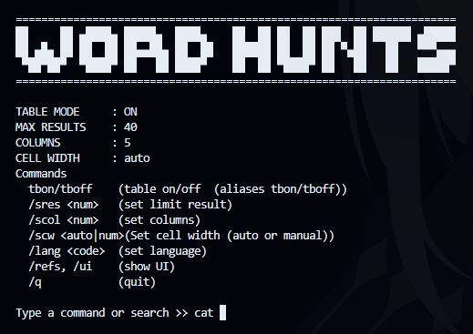
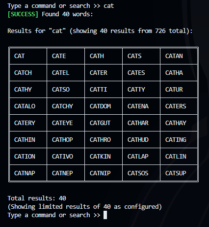

# Word Hunts

```
██     ██ ▄████▄ █████▄  ████▄    ██  ██ ██  ██ ███  ██ ██████ ▄█████
██ ▄█▄ ██ ██  ██ ██▄▄██▄ ██  ██   ██████ ██  ██ ██ ▀▄██   ██   ▀▀▀▄▄▄
 ▀██▀██▀  ▀████▀ ██   ██ ████▀    ██  ██ ▀████▀ ██   ██   ██   █████▀
```

<p align="center">
  <a href="https://www.npmjs.com/package/@jimbonlemu/word-hunts"></a>
  <a href="https://www.npmjs.com/package/@jimbonlemu/word-hunts"></a>
  <a href="https://github.com/jimbonlemu/word-hunts/blob/main/LICENSE"></a>
</p>

A fast and customizable command-line tool for searching English words by prefix.
Built for games like **Last Letter**, word puzzles, linguistics tools, and general word lookup.

This CLI loads a local dictionary (400k+ words) and performs instant prefix searches using an optimized binary-search algorithm.

---

## ✨ Features

- 🚀 **Instant prefix search** (optimized binary-search, extremely fast)
- 📚 Works fully **offline** with local dictionary (400k+ words)
- 🎯 **Direct search mode** or **interactive mode**
- 🌍 **Multilingual support** with English and Indonesian UI
- 🎛️ **Customizable output**
  - Table mode ON/OFF
  - Max result limit
  - Number of columns
  - Cell width (auto or manual)
- 🔧 Persistent settings via `config.json`
- 📐 Automatic terminal-width adaptation
- ✂️ Clean truncation for long words
- 🎮 Perfect for word-based games or productivity tools

---

## 📦 Installation

### Via NPM (Recommended)

```bash
npm install -g @jimbonlemu/word-hunts
```

### Via GitHub

```bash
git clone https://github.com/jimbonlemu/word-hunts
cd word-hunts
npm install
npm link
```

---

## 🚀 Usage

### Direct Search Mode

Quick search and exit. Perfect for one-off lookups or scripting.

```bash
wh cat
word-hunts hello
```

### Interactive Mode

Start interactive mode with UI. Great for multiple searches and exploring features.

```bash
wh
# or
word-hunts
```

After running, type any prefix:



Example output:



### Help & Version

```bash
wh --help
wh --version
```

### Language Switching

You can switch between supported languages in interactive mode:

```bash
/lang en    # Switch to English
/lang id    # Switch to Indonesian
```

---

## 🖥️ Commands

### Direct Mode

| Command | Description |
| --- | --- |
| `wh <prefix>` | Search words starting with prefix |
| `wh --help` | Show help message |
| `wh --version` | Show version |

### Interactive Mode

| Command | Description |
| --- | --- |
| `<prefix>` | Search words starting with prefix |
| `/help` | Show this help message |
| `/tbon` / `/tboff` | Toggle table mode (on/off) |
| `/lang <code>` | Switch language (en/id) |
| `/sres <num>` | Set result limit |
| `/scol <num>` | Set number of columns |
| `/scw <auto` / `num>` | Set cell width (auto or manual) |
| `/refs`, `/ui` | Refresh/Show UI header |
| `/q`, `/quit`, `/exit` | Quit the program |

---

## 🧠 How It Works

The CLI performs the following steps:

- Pre-sorts all words (case-insensitive)
- Finds the lower-bound match using binary search
- Collects all sequential matching prefixes
- Renders the output in table mode or plain mode
- Fits columns automatically to terminal width
- Truncates long words for clean alignment

---

## 📚 Dictionary Source

This CLI uses the `words_dictionary.json` file from [dwyl/english-words](https://github.com/dwyl/english-words).

The dictionary contains 479k English words, originally sourced from [Infochimps](https://web.archive.org/web/20131118073324/https://www.infochimps.com/datasets/word-list-350000-simple-english-words-excel-readable) and expanded by the dwyl community.

**License:** [Unlicense](https://unlicense.org/) (Public Domain)
All credit for the dictionary data belongs to the original authors.

---

## 📜 License

MIT © Mochamad Iqbal Maulana

See [LICENSE](LICENSE) file for details.

---

## 👤 Author

**Mochamad Iqbal Maulana**

- GitHub: [@jimbonlemu](https://github.com/jimbonlemu)
- NPM: [@jimbonlemu](https://www.npmjs.com/~jimbonlemu)

Made because I needed it and for fun. Maybe you need it too.

A simple & fast CLI to dominate any word-based challenge.

---

## 🙏 Acknowledgements

- [dwyl/english-words](https://github.com/dwyl/english-words) - For providing the comprehensive English word list
- [Infochimps](https://web.archive.org/web/20131118073324/https://www.infochimps.com/datasets/word-list-350000-simple-english-words-excel-readable) - Original word list source

---

## 🤝 Contributing

Contributions, issues, and feature requests are welcome!

Feel free to check the [issues page](https://github.com/jimbonlemu/word-hunts/issues).

---

## ⭐ Show Your Support

Give a ⭐️ if this project helped you!